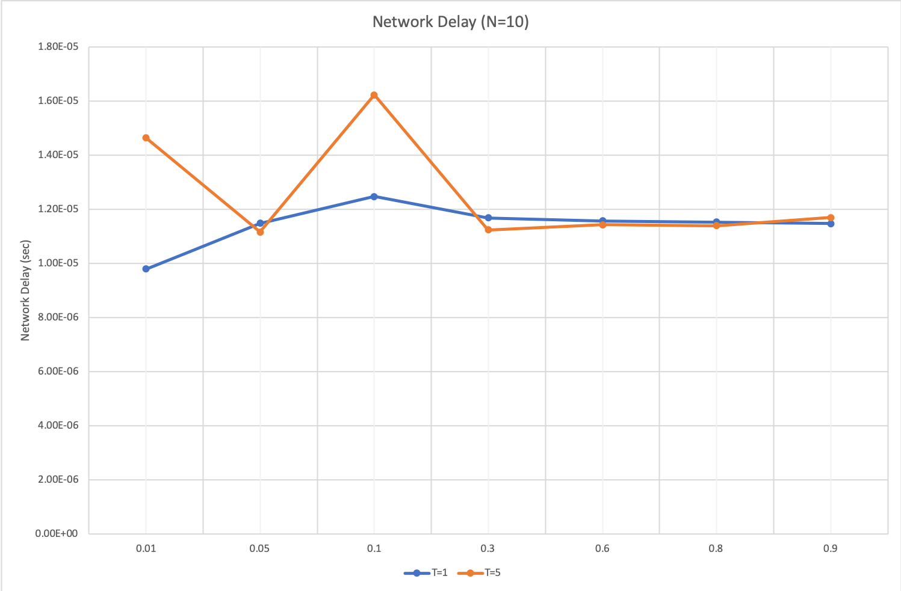
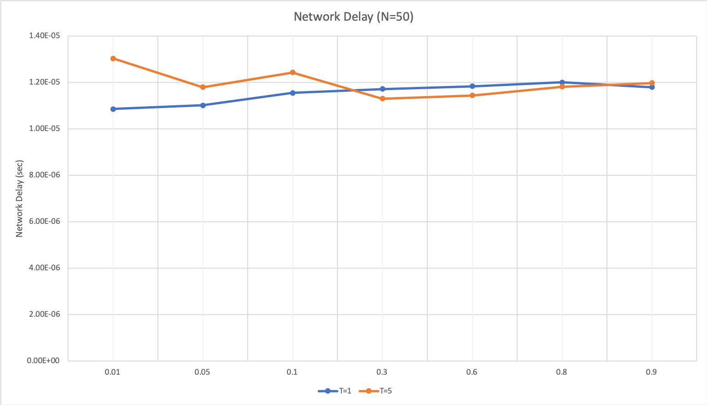
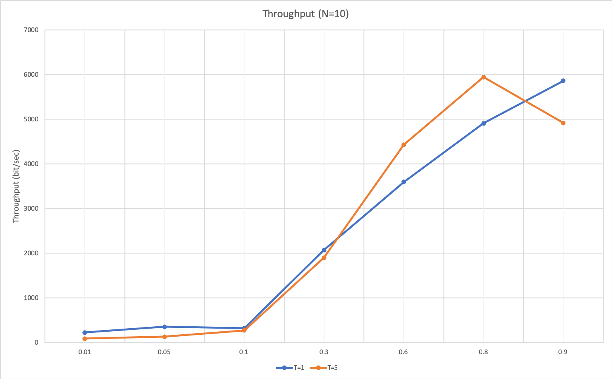
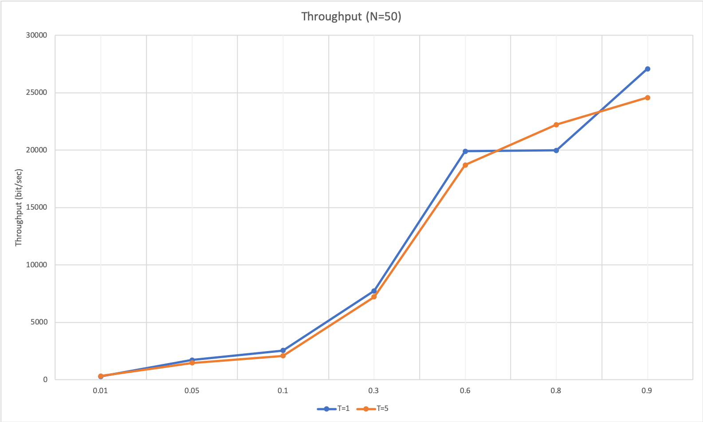

# Project 2 Report
**Team Members**: Lei Zuo, Josue Aleman, Sattar Ehtesham

## **Introduction**

In this project we wanted to simulate the 802.11 based WLAN competing stations model. The measurements we wanted to analyze are the **throughput** and the **average network delay**. 

**Language used**: For this project we decided to use **Python** as our programming language as the global event list and it's features from *Project 1* were implemeneted in Python. 

### **Data Structures Implemented**:

We maintained the same data structures from *Project 1*  such as the `Event` class, the Doubly Linked List, the `Packet` class and the `Buffer` class. 
New structures are as follows:

1. `Host` class which contains and instance of the `Buffer` class, along with some identifying variables such as its `host_number`, the `back_off` quantity in case the host needs to wait to transmit data.`delay_flag` which is used to calculate the average networ delay. `fail)times` counts how many times this host fails in sending dataframe, and is used to generate the `back_off_value` 
2. `States` enum class, which allows us to determine in which state the global event list is in.

### **Variables used**:

As with the data structures, we also maintined all of the variables from *Project 1* along with some new ones:

1. `N`- User provided, determines the number of hosts to simulate
2. `T`- User provided, the  max value of the range for the first time a backoff value must be generated
3. `sifs`- per the document is set to 0.05*msec*
4. `difs`- per the document is set to 0.1*msec*
5. `sense_interval`- per the document is set to 0.01 *msec*
6. `host_list` - this is a list that maintains the hosts
7. `state`- an instance of the `States` class which will determine what state the events are in
8. `transmission_rate`- user defined
9. `transmission_host`- 
10. `num_of_bytes`- keeps the sum of packages that were transmitted successfully
11. `total_delay`- an accumulator that keeps a sum of the delay in the system

    
### **Functions used**:
1. `nedt`- returns the negative exponential distributed random variable
2. `data_frame_length`- generated the dataframe length (*r*) using `nedt`
3. `generate_dest`**- it randomly selects destination host, other than itself
4. `back_off_value`- generate the backoff value for Host, takes two arguments, `fail_times` and `big_t`

## **Implementation**

We follow the logic that was provided in the document on page 2. We determined that ther was **6 event types** and managed to use four of them described below. We also conlcuded that **3 Channel States** were required as listed below.  

### Event types are:
1. **Arrival**- Generated exactly like project 1 using negative exponential distribution
2. **Departure**- Happens when *ACK* is received by source Host
3. **Sensing**- Generated every *0.1 msec* to simulate the Host detecting whether the channel is idle or not. It makes changes to the Host & Channel according to the buffer state and the channel state
4. **Not Used**
5. **Entering contention**- When backoff time begins to countdown
6. **Not Used**
   
### Channel State:
1. **IDLE** - Channel is IDLE waiting for dataframe
2. **BUSY** - Channel is occupied by some Host
3. **CONTENTION** - Special case of IDLE, where multiple Hosts countdown their backoff value. Collision will happen in this state.

**Collecting Statistics**:

Below are the graphs collected for N=10 and N=50 for both **Averge Network Delay** and **Throughput**

## **Conclusion**

####  Average Network Delay
We have conlcuded based on the graphs that as lambda increases, T's value will not make a difference and they seem to converge to the same average network delay. (**Note:** The formula provided in the project documentation is not correct in calculating the average newtork delay. The **correct formula** seems to be counting the delay for each packet and dividing by the package sent). When we have a larger T we had guessed that the average network delay would increase. 

#### Throughput
After analyzing the graphs, we can see that as lambda increases it looks like throughput increases linearly. If T gets larger we also notice that the throughput decreases, and we believe this is the case because with a larger T, the system spends more time in **IDLE** or **CONTENTION** state. 

